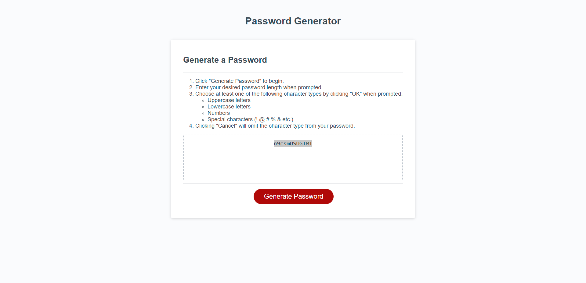

# Password Generator

## User Story
When button is clicked, user is prompted then random password is returned based on criteria of user selection.

## Contents
1. [Features](#features)
2. [Webpage](#webpage)
3. [Contributions](#contributions)

## Features
* Allows the user to select a password between 8 and 128 characters.
    * Doesn't allow user to select non-integers.
* Allows the user to select if they want uppercase, lowercase, numbers, and/or special characters (!@#$%&*+).
* Uses the JavaScript Math object to randomize a password from the user selected criteria.

## Webpage

[Deployed Password Generator](https://dereksutton.github.io/password-generator/)

## Contributions
- Starter code provided by Georgia Tech Full-Stack Coding Bootcamp
- Random password generator functionality added by [Derek Sutton](https://github.com/dereksutton)